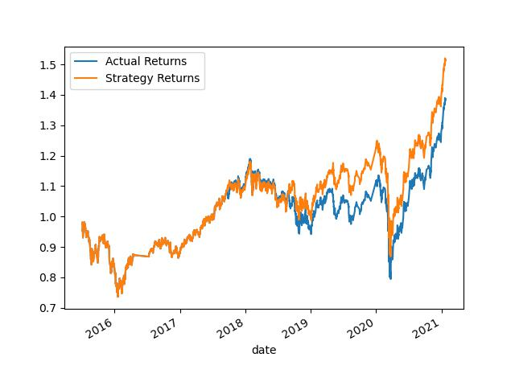
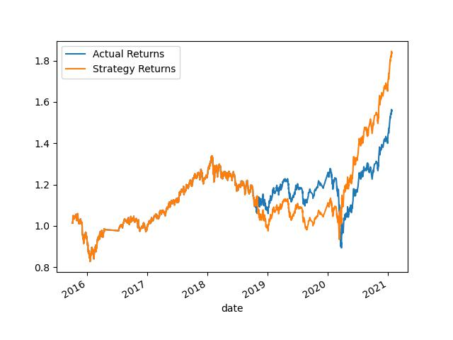
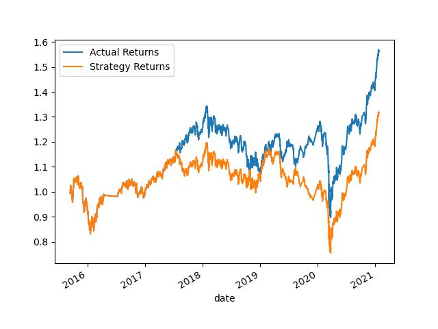
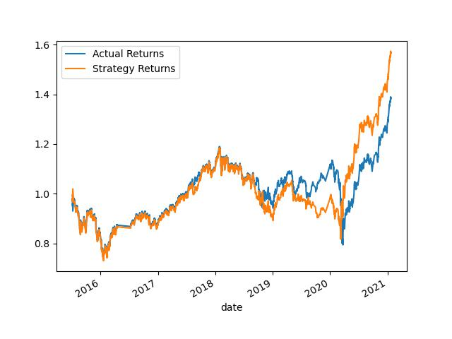

# Module 14 Challenge

## Overview

This project's goal is to create an algorithmic trading bot that learns and adapts to new data and evolving markets.

A total of four machine learning models were built and their performance compared in order to determine the best model and parameters for use in the trading bot.


---

## Data Preprocessing

Daily stock price information was first read into a pandas DataFrame. The daily closing price was then copied to a new 'signals' DataFrame and the daily returns were calculated using panda's pct_change function applied to the daily closing price.

Next, a window function was used to calculate the avearage return for a 'slow' and 'fast' trading period. These periods were appended to the 'signals' DataFrame.

A trading signal was then added indicating a 'buy' status of '1' if the daily return was equal to or greater than zero and 'sell' stus of '-1' if the daily return was less than zero.

After dropping any NA values the 'signals' DataFrame was then split into train and test data sets using the DateOffset function. The values for the 'slow' and 'fast' trading periods were used for the features (X datasets) while the signal value was used for the target variable (y datasets). Scikit-Learn's StandardScaler was then used to scale the features based upon the X training dataset and fit to the X training and X testing datasets.

The specific values used for the slow and fast trading periods as well as the date offset varied between the models and will detailed in the Model Defintions section.

---

## Model Definitions

In total, four machine learning models were built for evaluation. The intial model was used as a baseline and each of the subsequent 3 models changed either the model type, short/long window length or DateOffset value. The models themselves used the default parameters for that model type.

#### Baseline Model
The baseline model used was a Support Vector Classifier with the following parameters for the data preparation stage:


| Variable       | Value    |
|----------------|----------|
| "Short" window | 4 days   |
| "Long" window  | 100 days |
| DateOffset     | 3 months |


#### Alternate Model 1
The first alternate model was a Support Vector Classifier with the following parameters for the data preparation stage:

| Variable       | Value    |
|----------------|----------|
| "Short" window | 4 days   |
| "Long" window  | 100 days |
| DateOffset     | 6 months |


#### Alternate Model 2
The second alternate model was a Support Vector Classifier with the following parameters for the data preparation stage:

| Variable       | Value    |
|----------------|----------|
| "Short" window | 8 days   |
| "Long" window  | 200 days |
| DateOffset     | 3 months |


#### Alternate Model 3
The third alternate model was an AdaBoost Classifier with the following parameters for the data preparation stage:

| Variable       | Value    |
|----------------|----------|
| "Short" window | 4 days   |
| "Long" window  | 100 days |
| DateOffset     | 3 months |

---

## Results

After each model was built the test dataset was used to predict the buy/sell signal. This signal was then used to calcualte a stragegy (predicted) daily return by multiplying the actual return by the predicted signal. For evaluation, each model has it's accuracy, recall, precison and F1 score calculated and a plot was produced comparing the cumulative stragegy returns with the cumulative actual returns. 

Below is a summary of the evalution metrics for the four models. Values for precision, recall and F1 score are the weighted average scores.

| Model       | precision | recall | F1   | accuracy |
|-------------|-----------|--------|------|----------|
| Baseline    | 0.50      | 0.55   | 0.43 | 0.55     |
| Alternate 1 | 0.51      | 0.56   | 0.42 | 0.56     |
| Alternate 2 | 0.52      | 0.55   | 0.47 | 0.55     |
| Alternate 3 | 0.51      | 0.55   | 0.45 | 0.55     |


Actual vs Strategy return plots for each model are shown below:

#### Baseline



#### Alternate Model 1


#### Alternate Model 2


#### Alternate Model 3



---

## Summary

 While the evaluation metrics for the four models are all comparable to one another, the cumulative return plots show a marked difference between the performance. Based upon these plots, Alternate Model 1 has the best performance of the four models, showing a final cumulative return of ~1.8 while the Baseline and Alternate Model 3 achieved a final cumulative return of ~1.5 to 1.6.  

 Alternate Model 2 had the worst performance with a final cumulative return of only ~1.3. This model was the only model that showed a final performance below that of the actual returns.

 Alternate Model 1 should be selected for further tuning focusing on the model parameters themselves in an attempt to improve the models predictive power, thus leading to a further increase in the final cumulative returns obtained with the model.


---

## Technologies

All code is contained within the included jupyter lab notebook. 

Python version 3.9.15 was used to complete this challenge and the following additional libraries were utilized:
* pandas
* numpy
* jupyterlab

---

## Installation Guide

A working python environment is required. The included environmnet.yml file can be used to create a conda environment:

```
conda env create -f environment.yml

```


Alternatively, an existing environment can be used in which case Jupyter Lab, numpy, pandas, hvplot, sqlalchemy and voilà must be installed if not already available. They may be installed using pip:

```
pip install jupyterlab
pip install numpy
pip install pandas
```

---

## Usage

The included .ipynb file should be opened in Jupyter Lab, which can be started in the configured python environment

```
jupyter lab

```

Details on using Jupyter Lab are beyond the scope of this project. Please consult the [Jupyter Lab documentation](https://jupyterlab.readthedocs.io/en/stable/getting_started/overview.html) for usage details.


---

## Contributors

Code framework provided by FinTech Bootcamp.
Code completion by Thomas L. Champion.

---

## License

License information can be found in the included LICENSE file.


